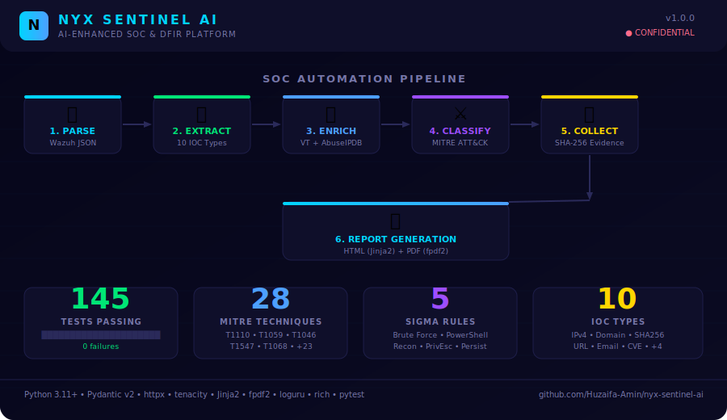
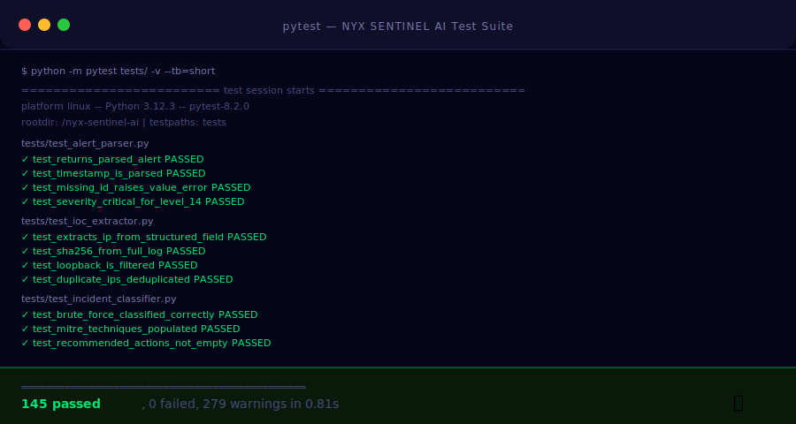
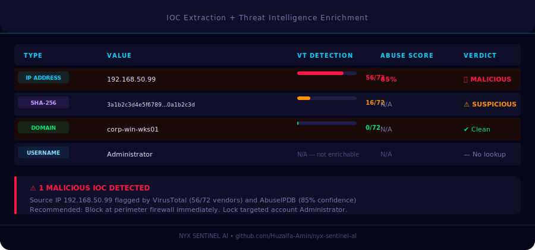

<div align="center">



# NYX SENTINEL AI

**AI-Enhanced SOC & Digital Forensics Incident Response Platform**

[](tests/)
[](https://python.org)
[](LICENSE)
[](https://attack.mitre.org)
[](https://wazuh.com)
[](https://virustotal.com)

*Final-year Cybersecurity Portfolio Project — TU Dublin MSc Applied Cyber Security*

</div>

---

## What It Does

NYX SENTINEL AI simulates the core workflow of a Security Operations Centre (SOC) analyst — fully automated in Python:

```
Wazuh Alert JSON  →  Parse  →  Extract IOCs  →  Enrich (VT + AbuseIPDB)
                  →  Classify (MITRE ATT&CK)  →  Collect Evidence  →  Report
```

---

## Screenshots





---

## Project Structure

```
nyx-sentinel-ai/
├── src/nyx_sentinel/
│   ├── config/settings.py            # Pydantic-settings — no secrets hardcoded
│   ├── parsers/
│   │   ├── models.py                 # ParsedAlert, IOC, EvidenceManifest models
│   │   └── alert_parser.py           # Wazuh JSON ingestion + strict validation
│   ├── extractors/ioc_extractor.py   # ReDoS-safe regex — 10 IOC types
│   ├── enrichment/threat_intel.py    # Async VirusTotal v3 + AbuseIPDB v2
│   ├── forensics/collector.py        # Evidence collection + SHA-256 hashing
│   ├── analysis/incident_classifier.py  # MITRE ATT&CK + weighted severity
│   ├── reporting/
│   │   ├── report_generator.py       # HTML + PDF generation
│   │   └── templates/incident_report.html.j2   # Dark SOC theme
│   └── rules/                        # 5 Sigma detection rules
│       ├── brute_force.yml
│       ├── suspicious_powershell.yml
│       ├── reconnaissance.yml
│       ├── privilege_escalation.yml
│       └── persistence.yml
├── tests/                            # 145 tests — 6 modules
├── data/sample_alerts/               # Realistic Wazuh JSON samples
├── data/mitre_attack/                # ATT&CK technique database (28 techniques)
├── scripts/run_pipeline.py           # Full CLI pipeline runner
└── docs/                             # Architecture, install guide, demo steps
```

---

## Quick Start

```bash
# 1. Clone
git clone https://github.com/Huzaifa-Amin/nyx-sentinel-ai.git
cd nyx-sentinel-ai

# 2. Virtual environment
python3 -m venv venv && source venv/bin/activate

# 3. Install
pip install -r requirements-dev.txt && pip install -e .

# 4. Configure (optional — demo works without API keys)
cp .env.example .env

# 5. Run demo pipeline
python scripts/run_pipeline.py data/sample_alerts/ --stub

# 6. Run tests
pytest tests/ -v
```

---

## Sample Alert Types Included

| File | Technique | Wazuh Level | Severity |
|------|-----------|-------------|----------|
| `brute_force_alert.json` | T1110 — Brute Force | 10 | HIGH |
| `powershell_alert.json` | T1059.001 — PowerShell | 12 | HIGH |
| `recon_alert.json` | T1046 — Network Discovery | 8 | MEDIUM |

---

## Detection Rules (Sigma Format)

| Rule | MITRE Techniques | Level |
|------|-----------------|-------|
| Brute Force | T1110, T1110.001, T1110.003 | HIGH |
| Suspicious PowerShell | T1059.001, T1027 | HIGH |
| Network Reconnaissance | T1046, T1018, T1082 | MEDIUM |
| Privilege Escalation | T1068, T1055, T1134 | CRITICAL |
| Persistence Mechanism | T1547.001, T1053.005, T1543.003 | HIGH |

---

## Security Controls

| Control | Implementation |
|---------|---------------|
| No hardcoded secrets | All API keys via `.env` / environment variables |
| Input validation | Pydantic v2 strict schemas on all untrusted input |
| Path traversal prevention | Whitelist + `Path.resolve()` before file operations |
| ReDoS protection | Anchored, length-limited regex patterns |
| XSS prevention | Jinja2 autoescape + `html.escape()` on all values |
| Timeout safety | All HTTP calls have explicit timeouts (httpx) |
| Retry safety | Exponential back-off with jitter (tenacity) |
| Evidence integrity | SHA-256 hash on every collected artifact |

---

## Tech Stack

| Layer | Technology |
|-------|-----------|
| Language | Python 3.11+ |
| Validation | Pydantic v2, pydantic-settings |
| HTTP | httpx (async) + tenacity |
| Templates | Jinja2 |
| PDF | fpdf2 |
| Logging | loguru |
| CLI | typer + rich |
| Tests | pytest, pytest-asyncio, pytest-cov |
| SIEM | Wazuh 4.x |
| IDS | Suricata 7.x |
| Detection | Sigma rules |
| ATT&CK | MITRE ATT&CK v14.1 |

---

## Free API Keys

| Service | Free Tier | Sign Up |
|---------|-----------|---------|
| VirusTotal | 4 requests/min | [virustotal.com](https://www.virustotal.com) |
| AbuseIPDB | 1,000 checks/day | [abuseipdb.com](https://www.abuseipdb.com) |

> Run with `--stub` flag for demos without API keys.

---

## License

MIT © 2024 NYX SENTINEL AI

---

<div align="center">
<sub>Built as a final-year cybersecurity portfolio project — MSc Applied Cyber Security, TU Dublin</sub>
</div>
